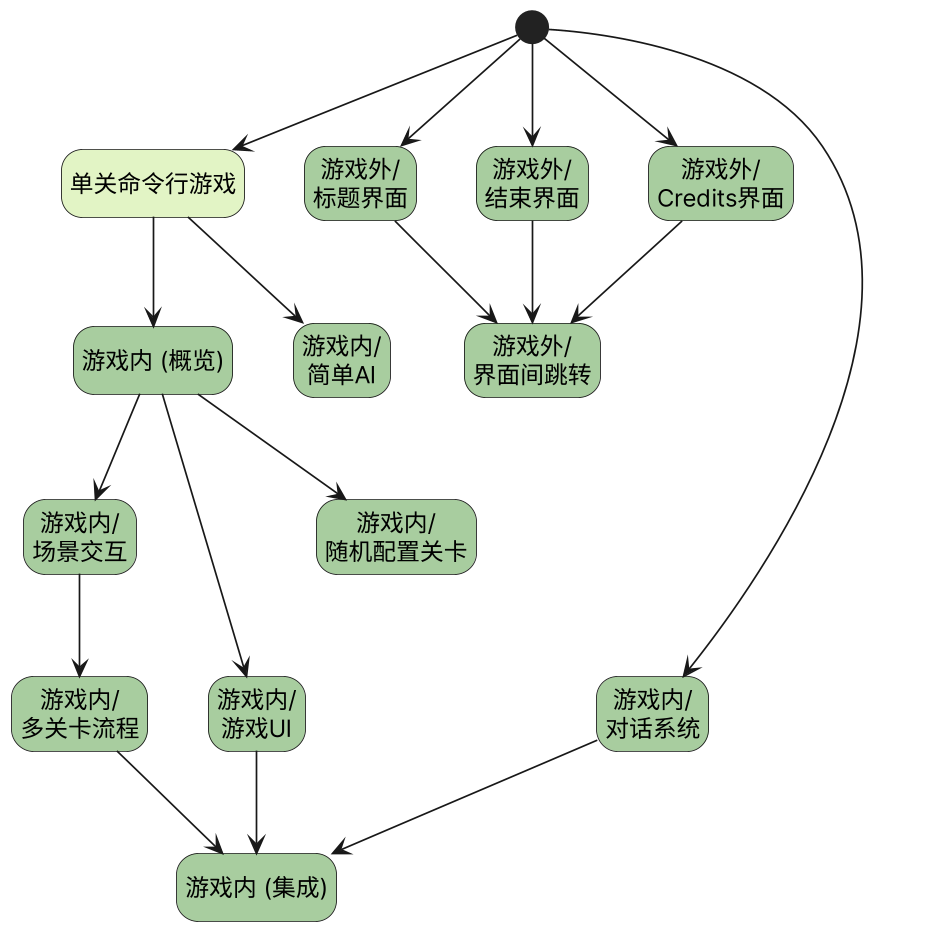

# Roulette

## 开发环境

Unity版本：2023.2.14f1c1

## 资产目录结构

- `Assets/Roulette/`
    - `Art/`: DCC多媒体资产
    - `Configs/`: 游戏配置文件
    - `Data/`: 存档和数据密集型配置文件
    - `Prefabs/`: 可复用模块
    - `Scenes/`: 测试场景和游戏场景
    - `Scripts/`: 所有的C#脚本
        - `Data/`: 配置文件定义脚本（继承ScriptableObject）
        - `Editor/`: Unity编辑器扩展
        - `General/`: 通用数据结构与算法（常规C#类、接口、枚举）
        - `Managers/`: 集中管理一系列相关的游戏实体
        - `Models/`: 纯游戏逻辑的建模脚本（常规C#类、接口、枚举）
        - `SceneCtrls/`: 与Scenes下的场景一一对应，实现场景特定的逻辑；相当于场景的main函数
        - `ViewCtrls/`: 单个游戏表现实体，例如可交互物品、UI面板

## 开发规范

尽可能减少IDE的警告。

## 专业名词表

|  分类  |         Term          |    术语     | 含义             |
|:----:|:---------------------:|:---------:|:---------------|
| 回合制  |         Level         |    关卡     | 从血量充盈到一方阵亡的过程  |
| 回合制  |         Round         |    轮次     | 从装弹到炸弹耗尽的过程    |
| 回合制  |         Turn          |    回合     | 玩家依次使用道具、引爆炸弹  |
| 玩法元素 |     Bullet / Bomb     |  子弹 / 炸弹  | 实弹造成伤害，虚弹不造成伤害 |
| 玩法元素 | Roulette / Bomb queue | 轮盘 / 炸弹队列 | 由实弹、虚弹组成的列表    |
| 玩法元素 |      Item / Card      |  卡牌 / 道具  | 开枪/引爆前变更局面的手段  |
|      |                       |           |                |

## 开发顺序

